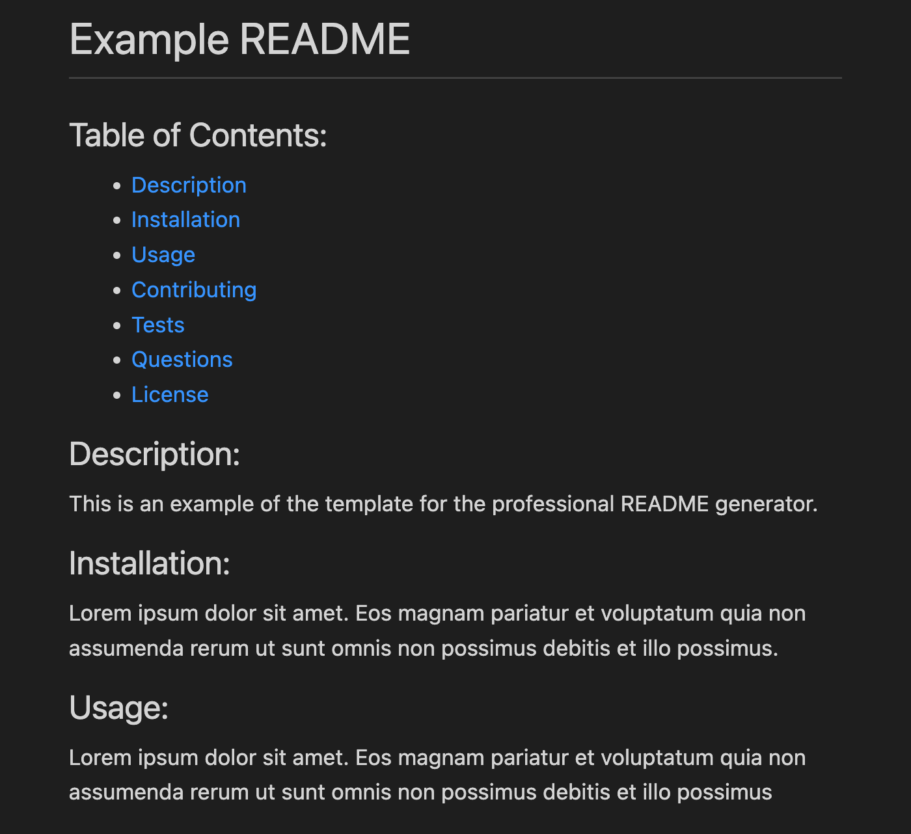
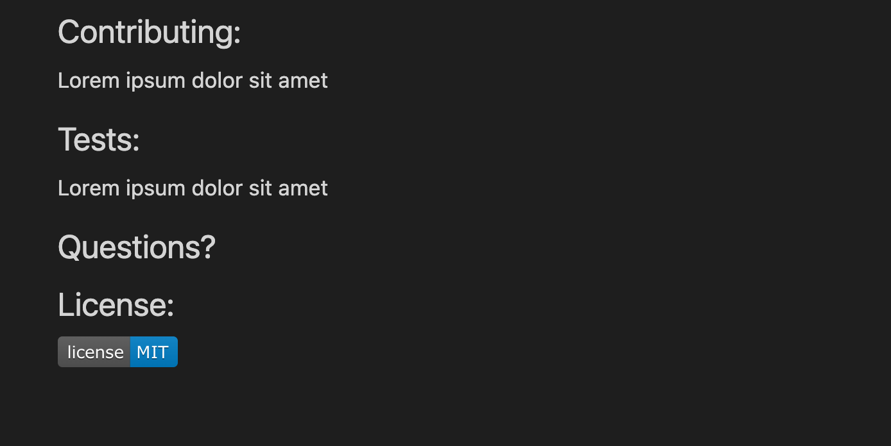

# Professional README Generator

## Description

This application allows users to quickly and easily create a professional README file by using a command-line application. This allows the project creator to devote more time to working on the project. The user enters the title, description, installation, usage, contributing, tests and any licenses that were used. When the user chooses a license, a badge will be created at the bottom of the README. 

## Mock-Up

